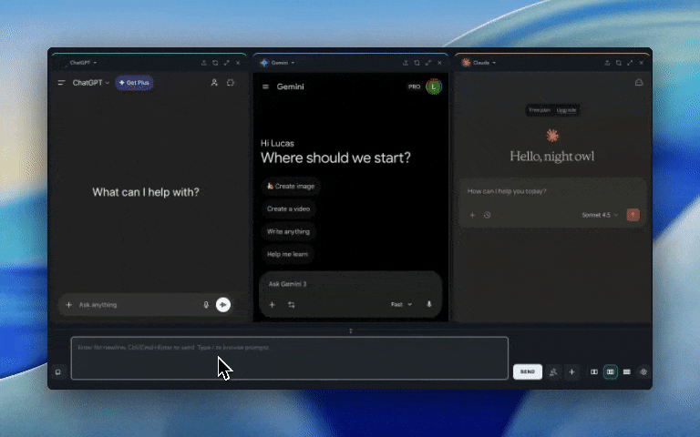

#

<h1 align="center">Ask All & Judge</h1>
<h3 align="center">Query multiple AI assistants simultaneously and let Judge AI compare responses All using your own subscriptions, no API required! <a href="./docs/README_ZH.md">[中文版本]</a> | <a href="https://wangcheng0116.github.io/Ask_all_and_Judge/">[Landing Page]</a> | <a href="https://chromewebstore.google.com/detail/ask-all-judge/mnlcnmacdgkpjgknnbajilpaigcmmpgm">[Chrome Web Store]</a></h3>

## Screenshots

## 🎯 Why Ask All & Judge?

Stop copying and pasting the same question across multiple AI tabs.

**Ask All & Judge** lets you:
- Query multiple AIs at once in a split-screen interface
- Use your existing subscriptions (no API keys or extra costs)
- Get a Judge AI to analyze and compare all responses for you

## ✨ Features

| Feature | Demo |
|---------|------|
| **🚀 Parallel Query** Send your question to multiple AIs simultaneously and see all responses side by side. |  |
| **⚖️ Judge AI** Let an AI judge analyze and compare all responses, highlighting key differences and insights. |  |
| **📚 Prompt Library** Save frequently used prompts with shortcuts. Type `/` to browse your library. |  |
| **📤 Export & Transfer** Transfer responses between AI services to continue conversations or get different perspectives. |  |

## 🔧 Installation

### Option 1: Chrome Web Store (Recommended)

Click the button above or visit: https://chromewebstore.google.com/detail/ask-all-judge/mnlcnmacdgkpjgknnbajilpaigcmmpgm

### Option 2: Manual Installation
1. Clone this repository
2. Open `chrome://extensions/` in Chrome
3. Enable **Developer mode**
4. Click **Load unpacked** and select the `ask-all-and-judge` folder

## 🔒 Privacy

- No data collection
- Uses your existing browser sessions
- No API keys required
- Runs entirely in your browser

## 📄 License

MIT License - see [LICENSE](./LICENSE) file.

---

Made with ❤️ for the AI community
